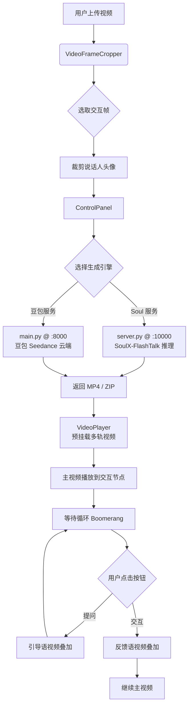

# 互动虚拟数字人系统（Interactive Virtual Human System）

## 📖 项目简介

本项目是一个完整的 **AI 驱动互动虚拟数字人视频生成与智能播放平台**。

其核心使用场景为：**教学、培训及互动问答场景下的数字人讲解演示**。用户可上传一段已有的讲解视频，在视频的关键"交互节点"处截取说话人的头像帧并精确裁剪，系统随后利用 AI 大模型（云端豆包 Seedance / 本地 SoulX-FlashTalk）根据预录制的引导语音与反馈语音动态生成对应的口型匹配视频，最终由定制化的高性能前端播放器实现：

> **主剧情视频 → 暂停等待 → 循环等待动作（Boomerang Loop）→ 点击"提问"→ 引导语口播 → 再次循环等待 → 点击"交互"→ 反馈语口播 → 继续播放主剧情**

整个流程在前端播放层实现无黑屏、无卡顿的丝滑视频过渡。

---

## 🏗️ 整体架构

```
virtual-human/
├── frontend/          # Web 前端应用（React + Vite + Tailwind CSS）
├── backend/           # Python 后端服务（FastAPI）
│   ├── main.py        # 豆包 Seedance 云端接入服务（端口 8000）
│   ├── server.py      # SoulX-FlashTalk 本地模型推理服务（端口 10000）
│   └── servers/
│       └── doubao_seedance.py   # 豆包 API 客户端封装
├── clone-TTS/         # 声音克隆与 TTS 音频生成
├── tools/             # 离线视频/音频处理脚本工具箱
└── data/              # 数据与媒体资产
```

---

## 🖥️ 前端（`frontend/`）

### 技术栈

| 技术 | 版本 | 用途 |
|------|------|------|
| React | 19.x | 核心 UI 框架 |
| Vite | 8.x | 构建工具 & 开发服务器 |
| Tailwind CSS | 3.x | 原子化样式 |
| `@ffmpeg/ffmpeg` | 0.12.x | 浏览器内视频处理（WASM） |
| `react-cropper` + `cropperjs` | 2.x / 1.x | 图像裁剪工具 |
| `react-easy-crop` | 5.x | 备用裁剪组件 |
| `jszip` | 3.x | 解压后端返回的 Zip 包 |
| `lucide-react` | 0.577.x | 图标库 |

### 应用结构（`src/`）

```
src/
├── App.jsx                        # 根组件，负责全局状态管理与布局
├── components/
│   ├── VideoFrameCropper.jsx      # 三阶段视频选帧裁剪组件
│   ├── ControlPanel.jsx           # 控制面板：服务选择、生成调度
│   ├── VideoPlayer.jsx            # 无缝互动视频播放器
│   └── ImageCropper.jsx           # 通用图像裁剪组件（备用）
├── index.css                      # 全局样式（含自定义时间轴 slider 样式）
└── main.jsx                       # React 入口
```

### 核心组件详解

---

#### 1. `App.jsx` — 全局状态总线

作为整个应用的顶层组件，`App.jsx` 维护以下共享状态，并通过 Props 在三个核心子组件之间传递：

| 状态 | 类型 | 说明 |
|------|------|------|
| `croppedImage` | `Blob` | 用户从视频帧裁剪出的说话人头像图片 |
| `interactionData` | `Object` | 包含 `videoSrc`、`interactionTime`、`cropArea`、`videoNaturalSize` |
| `guidanceVideo` | `URL string` | 生成的"引导语"视频地址 |
| `feedbackVideo` | `URL string` | 生成的"反馈语"视频地址 |
| `waitingVideo` | `URL string \| {forward, reverse}` | 等待循环视频（单 URL 或正反两段） |

**布局结构**：左侧为宽幅可滚动主区域（视频处理区 + 交互展示区），右侧为固定宽度 `400px` 的控制面板。

---

#### 2. `VideoFrameCropper.jsx` — 三阶段视频选帧裁剪

这是用户配置互动节点的入口组件，分为以下三个阶段（`stage`）：

**阶段一 `upload`：上传视频**
- 拖拽或点击上传，支持 MP4、WebM 等主流格式
- 使用 `URL.createObjectURL` 在内存中处理，无需上传服务器

**阶段二 `timeline`：时间轴选帧**
- 可播放/暂停视频，拖拽自定义时间轴 Slider 精确定位帧
- 点击"确认选取此帧"，将当前帧通过 Canvas 绘制为 PNG DataURL
- 同步记录 `interactionTime`（交互触发时间戳）和 `videoNaturalSize`（视频原始分辨率）

**阶段三 `crop`：图像裁剪**
- 将截取的帧图片交给 `react-cropper`（基于 CropperJS）进行裁剪
- 默认 1:1 纵横比，可缩放、旋转、自由移动裁剪框
- 防抖 150ms 后触发 `onCrop`，将裁剪结果 Blob + 元数据（`cropArea: {x, y, width, height}`）上报给 `App.jsx`

---

#### 3. `ControlPanel.jsx` — 生成调度与结果管理

控制面板是业务逻辑最复杂的组件，负责整个视频生成的调度流程。

**服务选择**

顶部 Tab 切换，当前支持两套生成引擎：
- **Soul 服务**：调用本地 `SoulX-FlashTalk` 大模型推理服务（地址 `http://10.195.0.3:10000`）
- **豆包服务**：调用云端火山引擎豆包 Seedance 生成服务（地址 `http://localhost:8000`）

**四个核心功能区**

| 区域 | 关键 API | 说明 |
|------|---------|------|
| **合并生成（Merge）** | `POST /merge_gen` | 一次性传入引导音频 + 反馈音频 + 视频片段，服务端返回 ZIP 包（含 loop/part1/part2 三段视频），前端自动解压分发 |
| **等待视频生成** | `POST /generate_boomerang` | 传入裁剪图片，生成"呼吸/眨眼"等待动作的正向和反向视频，返回 ZIP 包，前端解压为 `{forward, reverse}` 对象 |
| **引导语生成** | `v1`: `POST /sync_video`; `v2`: `POST /sync_video_crop` | v1 基于等待视频做口型同步；v2 从原视频中用 WebAssembly FFmpeg 裁剪交互节点后 10s 片段后同步 |
| **反馈语生成** | 同上（v2 使用倒放片段） | v2 中使用交互节点处的 10s 倒放视频片段做口型同步 |

**浏览器内 FFmpeg 视频处理**

使用 `@ffmpeg/ffmpeg`（WASM 版本）在浏览器内完成视频裁剪，无需服务端参与：

```js
// 伪代码：从 interactionTime 开始截取 10s 并应用裁剪滤镜
const args = ['-ss', startTime, '-t', '10', '-i', 'input.mp4', '-an',
              '-vf', 'crop=W:H:X:Y', '-c:v', 'libx264', 'output.mp4'];
await ffmpeg.exec(args);
```

**图像预处理**

上传给后端前，所有裁剪图片（Blob）均经过以下标准化处理：
- 统一缩放至 320×320（等比缩放后黑色填充补边）
- 输出格式为 `image/png`

---

#### 4. `VideoPlayer.jsx` — 无缝互动播放器

这是整个项目技术含量最高的组件，实现了类广播"软导播台"架构。

**核心设计：多轨道预挂载**

所有视频元素同时挂载为 DOM 节点（`waitingForward`、`waitingReverse`、`guidance`、`feedback`），通过 CSS `opacity` + `z-index` 切换可见性，从而消除视频首次加载时的黑屏延迟：

```jsx
<video src={waitingVideo.forward}
  style={{
    opacity: overlayMode === 'waiting' && waitingPhase === 'forward' ? 1 : 0,
    zIndex:  overlayMode === 'waiting' && waitingPhase === 'forward' ? 20 : -1,
  }}
  preload="auto"
/>
```

**五状态播放机**

| `overlayMode` | `waitingPhase` | 描述 |
|---------------|----------------|------|
| `null` | — | 主剧情视频正常播放 |
| `'waiting'` | `'forward'` | 等待动作正向播放 |
| `'waiting'` | `'reverse'` | 等待动作反向播放（实现 Boomerang Loop） |
| `'waiting'` | `'outro'` | Boomerang 退出过渡，从尾部跳至接近结尾处快速完成 |
| `'guidance'` | — | 引导语视频播放 |
| `'feedback'` | — | 反馈语视频播放 |

**交互节点触发逻辑**

原视频 `timeupdate` 事件中，采用时间窗口检测（`[-0.1s, +0.1s]`）防止跳帧丢失：

```js
if (video.currentTime >= interactionTime - 0.1 &&
    video.currentTime <= interactionTime + 0.1 &&
    !overlayTriggered.current) {
  overlayTriggered.current = true;
  video.pause();
  setOverlayMode('guidance'); // 或 'waiting'
}
```

**Boomerang 循环实现**

- 正向结束 → 切到反向，但只播放至 `duration - 2s`（防止首尾跳变）
- 反向完成 → 正向从第 `2s` 开始播放（跳过同样的 2s 过渡段）
- 用 `requestAnimationFrame` 精确监控反向播放进度以触发时间条件
- 当用户点击"提问/交互"时，触发 `startOutro`：反向视频跳至最后 2s 快速播完后，无缝切入引导/反馈视频

**叠加位置精确计算**

根据视频 `object-contain` 布局的实际缩放比和偏移量，将裁剪原始坐标精确映射到 DOM 位置：

```js
const scale = Math.min(containerW / natW, containerH / natH);
const offsetX = (containerW - displayW) / 2;
return {
  left: `${offsetX + cropArea.x * scale}px`,
  top:  `${offsetY + cropArea.y * scale}px`,
  width: `${cropArea.width * scale}px`,
  height: `${cropArea.height * scale}px`,
};
```

使用 `ResizeObserver` 监听容器尺寸变化，窗口缩放时自动重算叠加位置。

---

## ⚙️ 后端（`backend/`）

### `main.py` — 豆包 Seedance 云端接入服务

**启动端口**：`8000`  
**对接 API**：火山引擎方舟平台（`ark.cn-beijing.volces.com`）

#### 接口说明

| 路径 | 方法 | 说明 |
|------|------|------|
| `POST /generate` | multipart/form-data | 接收图片 + 音频，调用豆包生成说话人视频，返回 MP4 文件流 |
| `POST /generate_boomerang` | multipart/form-data | 生成等待动作视频，并用 FFmpeg 生成反向版本，打包 ZIP 返回 |
| `POST /api/video/create` | JSON | 原始豆包任务创建接口（调试用） |
| `GET /api/video/status` | query params | 查询任务状态（调试用） |

**核心流程（`/generate`）**：
1. 接收 `image_file`，检查图片最长边，若 < 380px 则等比放大至 380px
2. 将图片编码为 Base64 Data URL，作为豆包 API 的 `image_url` 字段
3. 调用 `create_image_to_video_task` 创建异步任务，获取 `task_id`
4. 每 2s 轮询 `get_video_generation_task`，最多等待 ~5 分钟（150 次重试）
5. 任务完成后，下载视频到本地临时目录，以 `FileResponse` 返回给前端，并注册 `BackgroundTask` 完成后自动删除临时文件

---

### `server.py` — SoulX-FlashTalk 本地模型推理服务

**启动端口**：`10000`  
**依赖模型**：
- `SoulX-FlashTalk-14B`（视频生成模型）
- `chinese-wav2vec2-base`（音频特征提取）
- `PyTorch` + `CUDA`

#### 推理流程

1. **模型加载**：在 FastAPI `lifespan` 中加载 pipeline，避免每次请求重新初始化
2. **音频预处理**：在音频首尾各填充 1s 静音，以防边缘帧质量下降
3. **分块推理（Streaming 模式）**：
   - 使用 `collections.deque` 维护滑动音频窗口（`cached_audio_duration` 时长）
   - 每次处理 `slice_len` 帧的音频切片并通过 `get_audio_embedding` 提取特征
   - 逐块调用 `run_pipeline` 推理，`motion_frames_num` 帧过渡帧用于拼接
4. **视频合成**：使用 `imageio` 写入无音频视频，再用 `ffmpeg` 合并音轨（`aac` 编码）

#### Boomerang 模式（`/generate_boomerang`）

在标准生成流程后额外执行：
- 将 `generated_list` 反转 + 帧倒序得到 `reverse_list`
- 用 `pydub` 将音频倒转
- 保存正向和反向两个 MP4，打包为 ZIP 返回

---

### `servers/doubao_seedance.py` — 豆包 API 客户端

封装了对火山引擎方舟平台的 HTTP 原生调用，不依赖任何第三方 SDK：

```python
# 创建视频生成任务
POST https://ark.cn-beijing.volces.com/api/v3/contents/generations/tasks
Authorization: Bearer {api_key}
Content-Type: application/json

# 查询任务状态
GET  https://ark.cn-beijing.volces.com/api/v3/contents/generations/tasks/{task_id}
```

---

## 🎙️ 声音克隆（`clone-TTS/`）

用于为数字人生成角色一致的配音音频：

| 文件 | 说明 |
|------|------|
| `tts.py` | TTS 语音合成脚本，将文本转换为目标角色的语音 |
| `feishu_test.py` | 基于飞书接口的批量音频生成与测试工具 |
| `process.py` | 音频后处理入口 |
| `克隆音频/`、`克隆音频v1/` | 不同版本克隆音频素材 |
| `安山老师音频/` | 当前使用的参考音频（用于声音克隆的 Speaker Embedding） |
| `*.wav` 文件 | 各种预录制时间节点的语音片段（命名规则：`pre/post{n}-{mm:ss.sss}.wav`） |

---

## 🛠️ 工具脚本（`tools/`）

一系列独立 Python 脚本，用于对视频和音频素材进行离线加工：

| 脚本 | 功能 |
|------|------|
| `jiasu.py` | 视频变速处理（生成 2x 加速版本以优化等待状态的流畅感） |
| `video_clip.py` | 按时间范围裁剪视频片段，支持多段批量处理 |
| `process_video.py` | 格式转换、分辨率调整、黑边裁剪等基础处理 |
| `process_audio.py` | 音频格式转换、静音段去除、音量均一化 |
| `wati_process.py` | 等待（Waiting）视频专项处理：正反拼接制作无缝循环素材 |
| `post_test.py / post_test1.py` | API 接口联调测试脚本 |

---

## 🔗 系统数据流



---

## 🚀 快速启动

### 前端

```bash
cd frontend
npm install
npm run dev
# 默认监听 http://localhost:5173
```

### 豆包云端服务（无需 GPU）

```bash
cd backend
pip install fastapi uvicorn pillow
python main.py
# 监听 http://localhost:8000
```

### SoulX-FlashTalk 本地推理服务（需要 CUDA GPU）

```bash
cd backend
# 确保已安装 PyTorch with CUDA、librosa、imageio、pydub、loguru 等依赖
# 并且 models/ 目录下有 SoulX-FlashTalk-14B 和 chinese-wav2vec2-base 模型文件
python server.py
# 监听 http://0.0.0.0:10000
```

---

## 📦 前端主要依赖说明

```json
{
  "dependencies": {
    "@ffmpeg/ffmpeg": "^0.12.15",    // 浏览器内视频处理（WebAssembly）
    "@ffmpeg/util": "^0.12.2",       // FFmpeg 辅助工具（fetchFile、toBlobURL）
    "cropperjs": "^1.6.2",           // 图像裁剪核心库
    "react-cropper": "^2.3.3",       // CropperJS 的 React 封装
    "react-easy-crop": "^5.5.6",     // 备用裁剪组件
    "jszip": "^3.10.1",              // 解压后端返回的 ZIP 包
    "lucide-react": "^0.577.0",      // SVG 图标库
    "clsx": "^2.1.1",                // 条件 class 拼接工具
    "tailwind-merge": "^3.5.0"       // Tailwind class 合并（覆盖去重）
  }
}
```

---

## ⚠️ 注意事项

1. **`@ffmpeg/ffmpeg` 需要 SharedArrayBuffer**：开发服务器需设置以下响应头，Vite 的 `vite.config.js` 中已配置 `Cross-Origin-Opener-Policy` 和 `Cross-Origin-Embedder-Policy`。

2. **后端 API 地址硬编码**：当前 Soul 服务地址为 `http://10.195.0.3:10000`，豆包服务为 `http://localhost:8000`，第三方同步服务为 `http://172.20.253.221:54321`。实际部署时需修改 `ControlPanel.jsx` 中的对应 URL。

3. **豆包 API Key**：当前 API Key 硬编码在 `main.py` 和 `servers/doubao_seedance.py` 中，生产环境建议通过环境变量注入。

4. **浏览器兼容性**：FFmpeg WASM 需要现代浏览器支持（Chrome 92+、Firefox 93+），Safari 需额外配置。


npm run build
npx vite preview --port 5173 --strictPort
